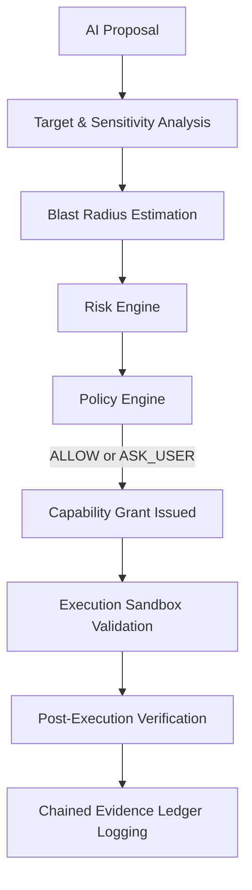

# CodeGuardian Security Model

CodeGuardian is built around a secure, governed execution pipeline where all agent operations are subject to deterministic gatekeeper checks, capability grants, and pre/post-execution validations.

## Governing Principles

1. **Model Independence**: Security controls are implemented entirely in native code, completely decoupled from LLM instructions.
2. **Zero Trust execution**: AI models can only *propose* actions. All actions are verified and executed by CodeGuardian.
3. **Fail-Closed**: Any ambiguity, validation error, syntax issue, or unknown state results in a `BLOCK` or escalation to `ASK_USER`.
4. **Tamper-Evident Evidence Logging**: Every step of governance is logged into a cryptographically chained, hash-verified ledger (`EvidenceLedger`).

## Governance Workflow

## Security Boundary Classification

> [!WARNING]
> **CodeGuardian provides policy governance and validation layers, not complete hardware-level containerization.**
> * **Policy Enforcement**: Guarantees command validation, AST syntax checks, directory boundaries, and cryptographic auditability.
> * **Process Isolation**: Confines directories and scrubs secret keys.
> * **OS Sandboxing**: CodeGuardian does *not* provide kernel isolation (e.g. gVisor, firecracker, docker boundaries). Production environments executing arbitrary agent code must run CodeGuardian inside a containerized sandbox.
